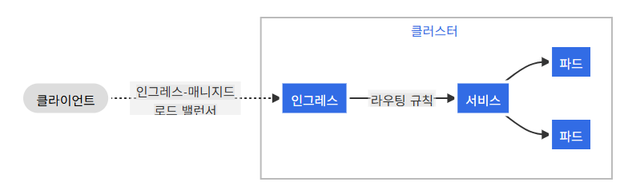
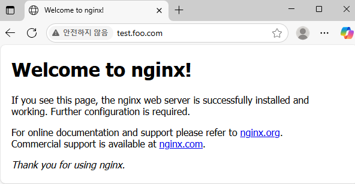
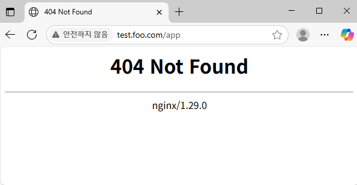

1. [Ingress](#1)<br>
  1.1. [Ingress](#1.1)<br>
  1.2. [Ingress 구성](#1.2)<br>


## <div id='1'> 1. Ingress

### <div id='1.1'> 1.1. Ingress

> 인그레스는 클러스터 외부에서 클러스터 내부 서비스로 HTTP와 HTTPS 경로를 노출한다. 트래픽 라우팅은 인그레스 리소스에 정의된 규칙에 의해 컨트롤된다.

인그레스가 모든 트래픽을 하나의 서비스로 보내는 간단한 예시.



(https://kubernetes.io/ko/docs/concepts/services-networking/ingress/)


인그레스는 외부에서 서비스로 접속이 가능한 URL. 로드 밸런스 트래픽, SSL / TLS 종료 그리고 이름 기반의 가상 호스팅을 제공하도록 구성할 수 있다.

인그레스 컨트롤러는 일반적으로 로드 밸런서를 사용해서 인그레스를 수행할 책임이 있으며, 트래픽을 처리하는데 도움이 되도록 edge router 또는 추가 프런트엔드를 구성할 수도 있다.

인그레스는 임의의 포트 또는 프로토콜을 노출시키지 않는다. 

- 전제 조건
  - 인그레스 컨트롤러가 있어야 인그레스를 충족할 수 있다.


### <div id='1.2'> 1.2. Ingress 구성

```
> POD 생성1 (namespace: ingress, name: ingress-nginx, image: nginx, port: 80)
> POD 생성2 (namespace: ingress, name: app-nginx, image: nginx, port: 80)
> "test.foo.com" 접속했을 때 ingress-nginx 서비스로 연결
> "test.foo.com/app" 접속했을 때 app-nginx 서비스로 연결
```

1. namespace 생성
```
ubuntu@qna-cluster-001:~/workspace/sun/test$ kubectl create ns ingress
namespace/ingress created
```

2. POD 생성1 (namespace: ingress, name: ingress-nginx, image: nginx, port: 80)
```
ubuntu@qna-cluster-001:~/workspace/sun/test$ kubectl run ingress-nginx --image=nginx --port=80 -n ingress
Warning: would violate PodSecurity "restricted:v1.31": allowPrivilegeEscalation != false (container "ingress-nginx" must set securityContext.allowPrivilegeEscalation=false), unrestricted capabilities (container "ingress-nginx" must set securityContext.capabilities.drop=["ALL"]), runAsNonRoot != true (pod or container "ingress-nginx" must set securityContext.runAsNonRoot=true), seccompProfile (pod or container "ingress-nginx" must set securityContext.seccompProfile.type to "RuntimeDefault" or "Localhost")
pod/ingress-nginx created

ubuntu@qna-cluster-001:~/workspace/sun/test$ kubectl expose pod ingress-nginx --name=ingress-nginx-svc --port=80 --type=ClusterIP -n ingress
service/ingress-nginx-svc exposed
ubuntu@qna-cluster-001:~/workspace/sun/test$ kubectl get svc -n ingress
NAME                TYPE        CLUSTER-IP     EXTERNAL-IP   PORT(S)   AGE
ingress-nginx-svc   ClusterIP   10.233.3.155   <none>        80/TCP    5s


```

3. POD 생성2 (namespace: ingress, name: app-nginx, image: nginx, port: 80)
```
ubuntu@qna-cluster-001:~/workspace/sun/test$ kubectl run app-nginx --image=nginx --port=80 -n ingress
Warning: would violate PodSecurity "restricted:v1.31": allowPrivilegeEscalation != false (container "app-nginx" must set securityContext.allowPrivilegeEscalation=false), unrestricted capabilities (container "app-nginx" must set securityContext.capabilities.drop=["ALL"]), runAsNonRoot != true (pod or container "app-nginx" must set securityContext.runAsNonRoot=true), seccompProfile (pod or container "app-nginx" must set securityContext.seccompProfile.type to "RuntimeDefault" or "Localhost")
pod/app-nginx created

ubuntu@qna-cluster-001:~/workspace/sun/test$ kubectl expose pod app-nginx --name=app-nginx-svc --port=80 --type=ClusterIP -n ingress
service/app-nginx-svc exposed
ubuntu@qna-cluster-001:~/workspace/sun/test$ kubectl get svc -n ingress
NAME                TYPE        CLUSTER-IP      EXTERNAL-IP   PORT(S)   AGE
app-nginx-svc       ClusterIP   10.233.16.231   <none>        80/TCP    3s
ingress-nginx-svc   ClusterIP   10.233.3.155    <none>        80/TCP    37s

```
4. "test.foo.com" 접속했을 때 ingress-nginx 서비스로 연결

```
apiVersion: networking.k8s.io/v1
kind: Ingress
metadata:
 name: ingress-nginx
spec:
  ingressClassName: "nginx"
  rules:
  - host: "test.foo.com"
    http:
      paths:
      - path: /
        pathType: Prefix
        backend:
          service:
            name: ingress-nginx-svc
            port:
              number: 80
      - path: /app
        pathType: Prefix
        backend:
          service:
            name: app-nginx-svc
            port:
              number: 80


ubuntu@qna-cluster-001:~/workspace/sun/test$ kubectl apply -f nginx-ingress.yaml -n ingress
ingress.networking.k8s.io/ingress-nginx created

ubuntu@qna-cluster-001:~/workspace/sun/test$ kubectl get ing -A
NAMESPACE   NAME            CLASS   HOSTS          ADDRESS       PORTS   AGE
ingress     ingress-nginx   nginx   test.foo.com   172.16.1.15   80      10m

```

5. 확인 작업
```

# ingress controller external ip 확인
ubuntu@qna-cluster-001:~/workspace/sun/test$ kubectl get svc -n ingress-nginx
NAME                                 TYPE           CLUSTER-IP      EXTERNAL-IP     PORT(S)                      AGE
ingress-nginx-controller             LoadBalancer   10.233.17.252   27.96.156.231   80:31080/TCP,443:31443/TCP   14d
ingress-nginx-controller-admission   ClusterIP      10.233.39.238   <none>          443/TCP                      14d


# 로컬 pc의 hosts파일

27.96.156.231 foo.bar.com   # 추가

```

6. 접속 테스트




7. test.foo.com/app 에러 확인 (app-nginx pod 로그 확인)



```
ubuntu@qna-cluster-001:~/workspace/sun/test$ kubectl logs app-nginx -n ingress
2025/07/02 07:29:01 [error] 15#15: *4 open() "/usr/share/nginx/html/app" failed (2: No such file or directory), client: 10.233.90.147, server: localhost, request: "GET /app HTTP/1.1", host: "test.foo.com"
10.233.90.147 - - [02/Jul/2025:07:29:01 +0000] "GET /app HTTP/1.1" 404 555 "-" "Mozilla/5.0 (Windows NT 10.0; Win64; x64) AppleWebKit/537.36 (KHTML, like Gecko) Chrome/138.0.0.0 Safari/537.36 Edg/138.0.0.0" "10.233.118.192"
```
> Nginx 에 /app 경로에 해당하는 파일이 없어 404 에러 발생

9. 해결방법

- 잘못된 경로로 요청시 루트경로로 리다이렉션 해준다.

- nginx-ingress.yaml 파일 수정
```
apiVersion: networking.k8s.io/v1
kind: Ingress
metadata:
 name: ingress-nginx
 annotations:
   nginx.ingress.kubernetes.io/rewrite-target: /        ## 추가
spec:
  ingressClassName: "nginx"
  rules:
  - host: "test.foo.com"
    http:
      paths:
      - path: /
        pathType: Prefix
        backend:
          service:
            name: ingress-nginx-svc
            port:
              number: 80
      - path: /app
        pathType: Prefix
        backend:
          service:
            name: app-nginx-svc
            port:
              number: 80
~  

ubuntu@qna-cluster-001:~/workspace/sun/test$ kubectl apply -f nginx-ingress.yaml  -n ingress
```
- 확인


