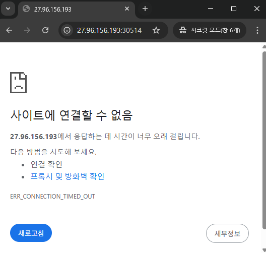
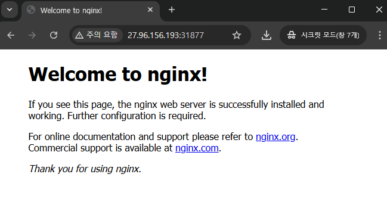
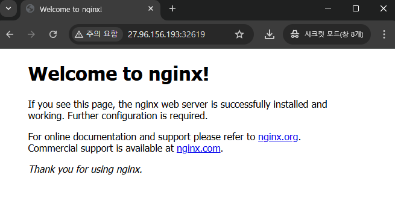

1. [Network Policy](#1)<br>
  1.1. [Network Policy](#1.1)<br>
  1.2. [pod · service 생성](#1.2)<br>
  1.2.1. [8080포트로 서비스 되는 nginx pod, service 생성](#1.2.1)<br>
  1.2.2. [pod를 이용한 named service 구성](#1.2.2)<br>


## <div id='1'> 1. Network Policy

### <div id='1.1'> 1.1. Network Policy
> IP주소 또는 포트 수준(OSI 계층 3 또는 4)에서 트래픽 호름을 제어하려는 경우, 네트워크 정책은 `클러스터 내의 트래픽 흐름뿐만 아니라 파드와 외부 간의 규칙을 정의`할 수 있도록 해준다. 클러스터는 반드시 네트워크 정책을 지원하는 `네트워크 플러그인`을 사용해야 한다.

- 네트워크폴리시는 파드가 네트워크 상의 다양한 네트워크 "엔티티"와 통신할 수 있도록 허용하는 방법을 지정할 수 있는 애플리케이션 중심 구조이다. 네트워크폴리시는 한쪽 또는 양쪽 종단이 파드인 연결에만 적용되며, 다른 연결에는 관여하지 않는다.

- 전제 조건
  * 네트워크 정책은 네트워크 플러그인으로 구현된다. 
  * 네트워크 정책을 사용하려면 네트워크폴리시는 지원하는 네트워킹 솔루션을 사용해야만 한다.
  

#### <div id='1.1.1'> 1.1.1. 예시 

- 쿠버네티스에서 각 파드는 기본적으로 서로 간에 모든 통신이 가능한 상태, 때문에 DB처럼 보안적으로 중요한 파드에 대한 접근을 제어하기 위하여 NetworkPlicy 서비스를 활용
- NetworkPolicy를 설정하지 않은 경우 모든 파드에서 DB 접근 가능
- 파드 생성 시 labels에 명시한 `key:valuue`를 기준으로 NetworkPolicy 적용

1. 특정 파드에서만 DB 접근을 허용하고자 하는 경우 <br>

```
apiVersion: networking.k8s.io/v1
 
kind: NetworkPolicy
 
metadata:
  name: db-policy
  namespace: prod
 
spec:
  podSelector:
    matchLabels:
      role: db
  policyTypes:
    - Ingress
  ingress:
    - from:
        - podSelector:
            matchLabels:
              role: api-pod # 특정 파드의 label
      ports:
        - protocol: TCP
          port: 3306
```
2. 특정 네임스페이스의 특정 파드에서만 접근을 허용하고자 하는 경우

```
apiVersion: networking.k8s.io/v1
 
kind: NetworkPolicy
 
metadata:
  name: db-policy
  namespace: prod
 
spec:
  podSelector:
    matchLabels:
      role: db
  policyTypes:
    - Ingress
  ingress:
    - from:
        - podSelector:
            matchLabels:
              role: api-pod  # 특정 파드의 라벨
          namespaceSelector:
            matchLabels:
              name: dev # 특정 네임스페이스
      ports:
        - protocol: TCP
          port: 3306
```

3. 특정 네임스페이스의 모든 파드에서 접근을 허용하고자 하는 경우
```
apiVersion: networking.k8s.io/v1
 
kind: NetworkPolicy
 
metadata:
  name: db-policy
  namespace: prod
 
spec:
  podSelector:
    matchLabels:
      role: db
  policyTypes:
    - Ingress
  ingress:
    - from:
        - namespaceSelector:
            matchLabels:
              name: dev # 특정 네임스페이스
      ports:
        - protocol: TCP
          port: 3306
```

4. 클러스터 외부의 특정 서버로부터 접근을 허용하고자 하는 경우
```
apiVersion: networking.k8s.io/v1
 
kind: NetworkPolicy
 
metadata:
  name: db-policy
  namespace: prod
 
spec:
  podSelector:
    matchLabels:
      role: db
  policyTypes:
    - Ingress
  ingress:
    - from:        
      - ipBlock:
          cidr: 192.168.1.100/32   ## 특정서버
      ports:
        - protocol: TCP
          port: 3306
```

5. DB에서 특정 파드로 접근을 허용하고자 하는 경우
```
apiVersion: networking.k8s.io/v1
 
kind: NetworkPolicy
 
metadata:
  name: db-policy
  namespace: prod
 
spec:
  podSelector:
    matchLabels:
      role: db  # db
  policyTypes:
    - Egress
  egress:
    - to:        
        - podSelector:
            matchLabels:
              role: etc-pod     # 특정 파드
      ports:
        - protocol: TCP
          port: 8080
```

6. DB에서 클러스터 외부의 특정 서버로 접근을 허용하고자 하는 경우
```
apiVersion: networking.k8s.io/v1
 
kind: NetworkPolicy
 
metadata:
  name: db-policy
  namespace: prod
 
spec:
  podSelector:
    matchLabels:
      role: db      # db
  policyTypes:
    - Egress
  egress:
    - to:        
        - ipBlock:
            cidr: 192.168.1.100/32  # 특정 서버
      ports:
        - protocol: TCP
          port: 8080
```
(참고: https://velog.io/@_zero_/%EC%BF%A0%EB%B2%84%EB%84%A4%ED%8B%B0%EC%8A%A4-%EB%84%A4%ED%8A%B8%EC%9B%8C%ED%81%AC-%EC%A0%95%EC%B1%85NetworkPolicy-%EA%B0%9C%EB%85%90-%EB%B0%8F-%EC%84%A4%EC%A0%95)


### <div id='1.2'> 1.2. Behavior of to and from selectors

```
> podSelector : 
- 특정 파드들을 선택하기 위함
- 레이블과 셀렉터를 사용하여 파드를 그룹화하고 관리하며, 서비스, 레플리카셋, 데몬셋 등 다양한 리소스에서 사용된다.

> namespaceSelector : 모든 파드가 인그레스 소스 또는 이그레스를 대상으로 허용되어야 하는 특정 네임스페이스를 선택한다.

> ipBlock : 인그레스 소스 또는 이그레스 대상으로 허용할 IP CIDR 범위를 선택한다. 파드 IP는 임시적이고 예측할 수 없기에 클러스터 외부 IP이어야 한다.

  - 클러스터 인그레스 및 이그레스 매케니즘은 종종 패킷의 소스 또는 대상 IP의 재작성을 필요로 한다. 이러한 상황이 발생하는 경우, 네크워크폴리시의 처리 전 또는 후에 발생한 것인지 정의되지 않으며, 네트워크 플러그인, 클라우드 공급자, 서비스 구현등의 조합에 따라 동작이 다를 수 있다.

  ex. 인그레스 사례에서의 의미는 실제 원본 소스 IP를 기준으로 들어오는 패킷을 필터링할 수 있는 반면에 다른 경우에는 네트워크폴리시가 작동하는 "소스IP"는 LoadBalancer 또는 파드가 속한 노드 등의 IP일 수 있다.

    이그레스의 경우 파드에서 클러스터 외부 IP로 다시 작성된 서비스 IP로의 연결은 ipBlock 기반의 정책의 적용을 받거나 받지 않을 수 있다는 것을 의미한다.
```

 ```> 참고 : ``` <div id='1.1.1'> 1.1.1. 예시 

(참고 : https://kubernetes.io/ko/docs/concepts/services-networking/network-policies/)

### <div id='1.3'> 1.3. NetworkPolicy 생성 후 접근 제어 실습
```
> POD 생성 (namespace: default, name: poc, image: nginx, port: 80, label: app=poc)
> "partition=customera"를 사용하는 namespace에서만 poc의 80포트로 연결할 수 있도록 default namespace에 'allow-webfrom-customera'라는 network Policy를 설정하세요.
> 보안 정책상 다른 namespace의 접근은 제한합니다.
```

1. pod 생성

```
ubuntu@qna-cluster-001:~/workspace/sun/test$ kubectl run poc --image=nginx --port=80 -l app=poc
Warning: would violate PodSecurity "restricted:v1.31": allowPrivilegeEscalation != false (container "poc" must set securityContext.allowPrivilegeEscalation=false), unrestricted capabilities (container "poc" must set securityContext.capabilities.drop=["ALL"]), runAsNonRoot != true (pod or container "poc" must set securityContext.runAsNonRoot=true), seccompProfile (pod or container "poc" must set securityContext.seccompProfile.type to "RuntimeDefault" or "Localhost")
pod/poc created

```

2. NetworkPolicy 생성 및 적용

```
apiVersion: networking.k8s.io/v1
kind: NetworkPolicy
metadata:
  name: allow-webfrom-customera
  namespace: default
spec:
  podSelector:
    matchLabels:
      app: poc      # 특정 pod 라벨
  policyTypes:
  - Ingress
  ingress:
  - from:
    - namespaceSelector:
        matchLabels:
          partition: customera  # "partition=customera"를 사용하는 namespace
    ports:
    - protocol: TCP
      port: 80

ubuntu@qna-cluster-001:~/workspace/sun/test/networkPolicy$ kubectl apply -f networkPolicy.yml 
networkpolicy.networking.k8s.io/allow-webfrom-customera created

```


3. test

- 네트워크 정책과 다르게 테스트

```
# namespace 생성
ubuntu@qna-cluster-001:~/workspace/sun/test/networkPolicy$ kubectl create ns customera
namespace/customera created

# namespace label 생성
ubuntu@qna-cluster-001:~/workspace/sun/test/networkPolicy$ kubectl label ns customera partition=customera
namespace/customera labeled

# pod 생성
ubuntu@qna-cluster-001:~/workspace/sun/test$ kubectl run poc --image=nginx --port=80 -l app=poc
Warning: would violate PodSecurity "restricted:v1.31": allowPrivilegeEscalation != false (container "poc" must set securityContext.allowPrivilegeEscalation=false), unrestricted capabilities (container "poc" must set securityContext.capabilities.drop=["ALL"]), runAsNonRoot != true (pod or container "poc" must set securityContext.runAsNonRoot=true), seccompProfile (pod or container "poc" must set securityContext.seccompProfile.type to "RuntimeDefault" or "Localhost")
pod/poc created

# 서비스 생성
ubuntu@qna-cluster-001:~/workspace/sun/test/networkPolicy$ kubectl expose pod poc --name=policy-svc --port=80 --type=NodePort
service/policy-svc exposed

ubuntu@qna-cluster-001:~/workspace/sun/test/networkPolicy$ kubectl get svc
NAME         TYPE        CLUSTER-IP      EXTERNAL-IP   PORT(S)        AGE
kubernetes   ClusterIP   10.233.0.1      <none>        443/TCP        14d
policy-svc   NodePort    10.233.32.198   <none>        80:30514/TCP   13s

```
접속테스트




```
# 네트워크 정책 삭제

ubuntu@qna-cluster-001:~/workspace/sun/test/networkPolicy$ kubectl expose pod poc --name=policy-svc --port=80 --type=NodePort 
service/policy-svc exposed
ubuntu@qna-cluster-001:~/workspace/sun/test/networkPolicy$ kubectl get svc 
NAME         TYPE        CLUSTER-IP      EXTERNAL-IP   PORT(S)        AGE
kubernetes   ClusterIP   10.233.0.1      <none>        443/TCP        14d
policy-svc   NodePort    10.233.36.186   <none>        80:31877/TCP   5s

```
접속 성공



- 네트워크 정책 조건에 맞게 생성

```
# pod 생성

ubuntu@qna-cluster-001:~/workspace/sun/test/networkPolicy$ kubectl run poc --image=nginx --port=80 -l app=poc -n customera
Warning: would violate PodSecurity "restricted:v1.31": allowPrivilegeEscalation != false (container "poc" must set securityContext.allowPrivilegeEscalation=false), unrestricted capabilities (container "poc" must set securityContext.capabilities.drop=["ALL"]), runAsNonRoot != true (pod or container "poc" must set securityContext.runAsNonRoot=true), seccompProfile (pod or container "poc" must set securityContext.seccompProfile.type to "RuntimeDefault" or "Localhost")
pod/poc created
ubuntu@qna-cluster-001:~/workspace/sun/test/networkPolicy$ kubectl get pods -n customera
NAME   READY   STATUS    RESTARTS   AGE
poc    1/1     Running   0          7s

# svc 생성
ubuntu@qna-cluster-001:~/workspace/sun/test/networkPolicy$ kubectl expose pod poc --name=policy-svc --port=80 --type=NodePort -n customera
service/policy-svc exposed
ubuntu@qna-cluster-001:~/workspace/sun/test/networkPolicy$ kubectl get svc -n customera
NAME         TYPE       CLUSTER-IP      EXTERNAL-IP   PORT(S)        AGE
policy-svc   NodePort   10.233.14.227   <none>        80:32619/TCP   11s

```

- 접속 결과


