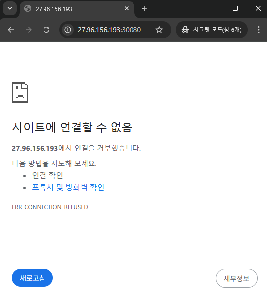
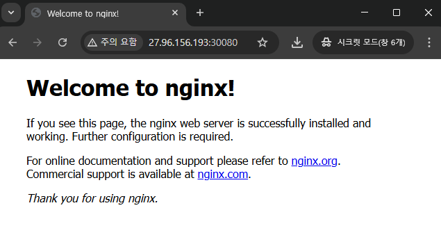

1. [Service](#1)<br>
  1.1. [Service Type](#1.1)<br>
  1.2. [pod · service 생성](#1.2)<br>
  1.2.1. [8080포트로 서비스 되는 nginx pod, service 생성](#1.2.1)<br>
  1.2.2. [pod를 이용한 named service 구성](#1.2.2)<br>


  


## <div id='1'> 1. Service

### <div id='1.1'> 1.1. Service Type

- ClusterIP, NodePort, LoadBalancer
 > ClusterIP : 서비스를 클러스터-내부 IP에 노출시킨다. 이 값을 선택하면 클러스터 내에서만 서비스에 도달할 수 있다. 이것은 서비스의 type을 명시적으로 지정하지 않았을 때의 기본값이다.
   * 클러스터 내에서만 접근 가능한 가상 IP주소
   * 모든 ClusterIP는 항상 고유해야 한다.
   * 동적할당/정적할당
     - 동적할당: 클러스터의 컨트롤 플레인이 자동으로 type: ClusterIP 서비스의 설정된 IP 범위 내에서 가용 IP 주소를 선택한다.
     - 정적할당: 서비스용으로 설정된 IP범위 내에서 사용자가 IP주소를 선택한다.

(ClusterIP: https://kubernetes.io/ko/docs/concepts/services-networking/cluster-ip-allocation/)
(ClusterIP: https://kubernetes.io/ko/docs/concepts/services-networking/service/)

> NodePort: 고정 포트 (NodePort)로 각 노드의 IP에 서비스를 노출시킨다. 노드 포트를 사용할 수 있도록 하기 위해, 쿠버네티스는 type: ClusterIP인 서비스를 요청했을 때와 마찬가지로 클러스터 IP 주소를 구성한다.
  * NodePort는 `30000 ~ 32767` 범위 내에서 할당된다.
  * 노드포트 서비스는 앱의 수신 요청에 대한 외부 시작점 역할
  * 인터넷에서 서비스에 액세스하려면, 클러스터 노드의 공용 IP 주소와 <IP_address>:<nodePort>형식 사용

(Nodeport: https://kubernetes.io/ko/docs/concepts/services-networking/service/)

> LoadBalancer: 클라우드 플랫폼에서 제공하는 Load Balancer를 동적으로 Provisioning하여 포드에 연결한다. NodePort 타입과 마찬가지로 외부에서 포드에 접근할 수 있는 서비스 타입이다. 일반적으로 AWS, GCP 등과 같은 클라우드 플랫폼 환경에서만 이용할 수 있다.
  * 로드밸런서는 노드 앞단에 배치되며 각 노드로 트래픽을 분산시킬 수 있다.
  * 외부 서버에 직접적으로 포트 번호를 공개할 필요 없이 직접 접근을 하지 않아도 로드밸런서의 엔드포인트를 통해 어플리케이션에 접근할 수 있다.
  * 직접적으로 특정 노드로 요청을 보내는 대신, 로드밸런서를 통해 사용가능한 노드 대상으로 트래픽을 전달한다.
  * 로드밸런서는 모든 노드에 균등하게 트래픽을 전달한다.

### <div id='1.2'> 1.2. pod · service 생성


#### <div id='1.2.1'> 1.2.1. 8080포트로 서비스 되는 nginx pod, service 생성

```
> namespace: devops
> service name: internal-svc
> type: ClusterIP
> port: 8080
```


```
# devops namespace 생성
ubuntu@qna-cluster-001:~$ kubectl create ns devops
namespace/devops created

# 8080포트로 서비스되는 nginx pod 생성
ubuntu@qna-cluster-001:~$ kubectl run nginx-pod --image=nginx --port=8080 -n devops
Warning: would violate PodSecurity "restricted:v1.31": allowPrivilegeEscalation != false (container "nginx-pod" must set securityContext.allowPrivilegeEscalation=false), unrestricted capabilities (container "nginx-pod" must set securityContext.capabilities.drop=["ALL"]), runAsNonRoot != true (pod or container "nginx-pod" must set securityContext.runAsNonRoot=true), seccompProfile (pod or container "nginx-pod" must set securityContext.seccompProfile.type to "RuntimeDefault" or "Localhost")
pod/nginx-pod created
ubuntu@qna-cluster-001:~$ kubectl get pods -n devops
NAME        READY   STATUS    RESTARTS   AGE
nginx-pod   1/1     Running   0          31s


# ClusterIP 서비스 생성
ubuntu@qna-cluster-001:~$ kubectl expose pod nginx-pod --name=internal-svc --port=8080 --type=ClusterIP -n devops
service/nginx-svc exposed
ubuntu@qna-cluster-001:~/workspace/sun$ kubectl get svc -n devops
NAME           TYPE        CLUSTER-IP      EXTERNAL-IP   PORT(S)    AGE
internal-svc   ClusterIP   10.233.19.176   <none>        8080/TCP   14s

```

#### <div id='1.2.2'> 1.2.2. pod를 이용한 named service 구성

> 미리 배포한 'nginx pod'에 기존의 nginx 컨테이너의 포트 '8080/tcp'를 expose하는 'http'라는 이름을 추가
> 컨테이너 포트 http를 expose하는 'front-end-svc'라는 30080포트로 운영되는 새 service를 만들고, 준비된 node의 'NodePort'를 통해 개별 Pods를 expose되도록 Service를 구성
> targetPort 는 숫자가 아닌 문자로 작성


1.  미리 배포한 'nginx pod'에 기존의 nginx 컨테이너의 포트 '8080/tcp'를 expose하는 'http'라는 이름을 추가
```
ubuntu@qna-cluster-001:~/workspace/sun$ kubectl get pod nginx-pod -o yaml -n devops > nginx-pod.yml
ubuntu@qna-cluster-001:~/workspace/sun$ ls
nginx-pod.yml  

ubuntu@qna-cluster-001:~/workspace/sun$ vi nginx-pod.yml

# 수정전
spec:
  containers:
  - image: nginx
    imagePullPolicy: Always
    name: nginx-pod
    ports:
    - containerPort: 8080
      protocol: TCP

# 수정후
spec:
  containers:
  - image: nginx
    imagePullPolicy: Always
    name: http
    ports:
    - containerPort: 8080
      protocol: TCP
      name: http

ubuntu@qna-cluster-001:~/workspace/sun$ kubectl apply -f nginx-pod.yml -n devops
Warning: would violate PodSecurity "restricted:v1.31": allowPrivilegeEscalation != false (container "http" must set securityContext.allowPrivilegeEscalation=false), unrestricted capabilities (container "http" must set securityContext.capabilities.drop=["ALL"]), runAsNonRoot != true (pod or container "http" must set securityContext.runAsNonRoot=true), seccompProfile (pod or container "http" must set securityContext.seccompProfile.type to "RuntimeDefault" or "Localhost")
pod/nginx-pod created


## 컨테이너 포트 http를 expose하는 'front-end-svc'라는 30080포트로 운영되는 새 service를 만들고, 준비된 node의 'NodePort'를 통해 개별 Pods를 expose되도록 Service를 구성

ubuntu@qna-cluster-001:~/workspace/sun$ kubectl expose pod nginx-pod --name front-end-svc --port 8080 --type NodePort --target-port http -n devops
service/front-end-svc exposed
ubuntu@qna-cluster-001:~/workspace/sun$ kubectl get svc -n devops
NAME            TYPE       CLUSTER-IP      EXTERNAL-IP   PORT(S)          AGE
front-end-svc   NodePort   10.233.40.186   <none>        8080:32394/TCP   5s

## 노드포트 30080으로 수정
ubuntu@qna-cluster-001:~/workspace/sun/test$ kubectl edit svc front-end-svc -n devops -oyaml

# 수정전
  ports:
  - nodePort: 32394
    port: 8080
    protocol: TCP
    targetPort: http

# 수정후
  ports:
  - nodePort: 30080
    port: 8080
    protocol: TCP
    targetPort: http

# 확인

ubuntu@qna-cluster-001:~/workspace/sun$ kubectl get svc -n devops
NAME            TYPE       CLUSTER-IP      EXTERNAL-IP   PORT(S)          AGE
front-end-svc   NodePort   10.233.40.186   <none>        8080:30080/TCP   104s
```

>결과



<details>
<summary>8080으로 nginx 접속 안되는 이유</summary>
기본 nginx docker 이미지에는 listen 포트가 80으로 되어 있기 때문에
컨테이너 포트 8080을 열어도 Nginx는 8080 포트에서 리스닝하지 않는다.
</details>

<br>

> Nginx 8080포트를 NodePort로 노출하기

1. nginx configmap을 생성한다.
```
apiVersion: v1
kind: ConfigMap
metadata:
  name: nginx-cm
  namespace: devops
data:
  default.conf: |
    server {
        listen       8080;
        server_name  localhost;

        location / {
            root   /usr/share/nginx/html;
            index  index.html;
        }
    }
```
2. Configmap을 사용하기 위해서 nginx 파드 yaml 파일에 volume과 volumeMount를 추가해준다.
```
  volumes:
  - name: nginx-cm
    configMap:
      name: nginx-cm

    volumeMounts:
    - mountPath: /var/run/secrets/kubernetes.io/serviceaccount
      name: kube-api-access-vh96h
      readOnly: true
    - name: nginx-cm
      mountPath: /etc/nginx/conf.d

      volumeMounts:
    - name: nginx-cm
      mountPath: /etc/nginx/conf.d
    - mountPath: /var/run/secrets/kubernetes.io/serviceaccount
      name: kube-api-access-vh96h
      readOnly: true
      recursiveReadOnly: Disabled
```

3. 서비스 배포
```
kubectl expose pod nginx-pod --name front-end-svc --port 8080 --type NodePort --target-port http -n devop
```

4. NodePort 를 30080으로 수정
```
ubuntu@qna-cluster-001:~/workspace/sun/test$ kubectl edit svc front-end-svc -n devops -oyaml

# 수정 전

  ports:
  - nodePort: 31922
    port: 8080
    protocol: TCP
    targetPort: http
  selector:

# 수정 후

  ports:
  - nodePort: 30080
    port: 8080
    protocol: TCP
    targetPort: http
  selector:


```

5. 접속 확인




